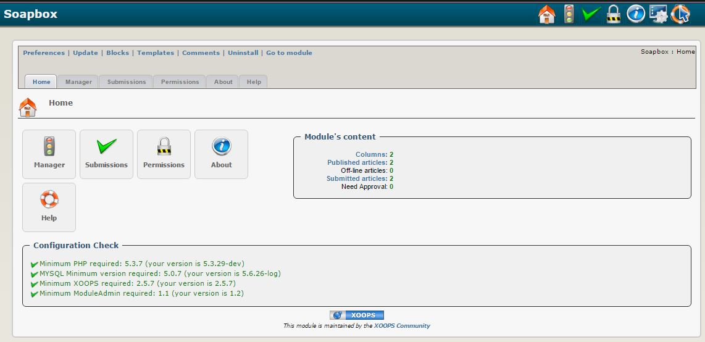

### _XOOPS Documentation Series_

# Модуль Soapbox
#### для XOOPS 2.5.8

Версия модуля 1,7 Beta 1

Учебное пособие по версии 1.0
      

            
## Руководство пользователя

© 2018 XOOPS Project ([www.xoops.org](https://xoops.org))  

## Назначение модуля 

Модуль предназначен для публикации статей упорядоченных по категориям.

*Фигура 1: Общий вид модуля Soapbox (Admin сторона)*

## Загрузить модуль  

**Вы можете загрузить последнюю версию модуля --> [here](https://github.com/XoopsModules25x/soapbox))** 

## Как внести свой вклад

[Вы можете внести свой вклад в GitHub](https://github.com/XoopsDocs/lexikon-tutorial). Изменения будут [обмен с Gitbook.io автоматический](https://www.gitbook.com/book/xoops/lexikon-tutorial/activity) когда [главный репозиторий](https://github.com/XoopsDocs/lexikon-tutorial) изменения.

Редактирование книги может быть сделано либо путем обновления файлов с помощью текстового редактора, или с помощью приложения [приложение Gitbook](https://github.com/GitbookIO/editor/blob/master/README.md). Приложение даст Вам возможность предварительного просмотра.

# Содержание

* [Введение](book/0introduction.md)
* [Установка/Удаление](book/1install.md)
* [Меню администратора](book/2administration.md)
* [Настройки](book/3preferences.md)
* [Инструкция по эксплуатации](book/4operations.md)
* [Сторона пользователя](book/5userside.md)
* [Блоки](book/6blocks.md)
* [Шаблоны](book/7templates.md)
* [Другое](book/8other.md)
* [Module Credits](book/9credits.md)
* [About XOOPS CMS](book/10aboutxoops.md)

## Лицензия:

 Unless specified, this content is licensed under a <a rel="license" href="http://creativecommons.org/licenses/by-nc-sa/4.0/">Creative Commons Attribution-NonCommercial-ShareAlike 4.0 International License</a>.

All derivative works are to be attributed to XOOPS Project ([www.xoops.org](https://xoops.org))
